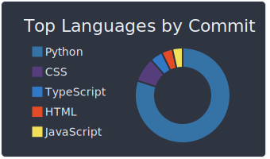
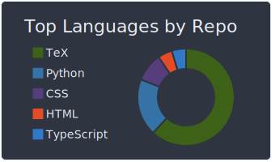

# HELLO WORLD

## 👋 Hi there

I'm Kitamado. I majored in mathematics (number theory and discrete optimization) at university.

I'm working on web development now.

Here are languages and tools I've ever used.

| description              | skill icons                                                                                            |
| ------------------------ | ------------------------------------------------------------------------------------------------------ |
| markup language          | [](https://skillicons.dev)                      |
| shell script             | [](https://skillicons.dev)               |
| languages for web, maybe | [](https://skillicons.dev)                 |
| general-purpose language | [](https://skillicons.dev)             |
| framework                | [](https://skillicons.dev) |
| database                 | [](https://skillicons.dev)                  |
| other tools              | [](https://skillicons.dev)              |

## 🌱 I wish to do

I am taking Computer Science classes at edX while working. I am currently working on CS50 Web Programming.

I'm really more interested in security and cryptography than web development.

## 🎓 Education

| Degree   | Institute                                   | Description              |
| -------- | ------------------------------------------- | ------------------------ |
| Bachelor | Kyoto University                            | Faculty of Science       |
| Master   | Research Institute for Mathematical Science | on Discrete Optimization |

## :bar_chart: My Coding Activity

### GitHub Summary

[](https://github.com/anuraghazra/github-readme-stats)

[](https://github.com/vn7n24fzkq/github-profile-summary-cards)

### [WakaTime Stats](https://github.com/marketplace/actions/waka-readme)

<!--START_SECTION:waka-->

```text
From: 09 October 2022 - To: 16 October 2022

Total Time: 13 hrs 24 mins

JavaScript   3 hrs 51 mins   ███████▒░░░░░░░░░░░░░░░░░   28.83 %
Markdown     3 hrs 41 mins   ███████░░░░░░░░░░░░░░░░░░   27.58 %
HTML         2 hrs 12 mins   ████░░░░░░░░░░░░░░░░░░░░░   16.45 %
JSON         1 hr 28 mins    ██▓░░░░░░░░░░░░░░░░░░░░░░   10.99 %
TypeScript   51 mins         █▓░░░░░░░░░░░░░░░░░░░░░░░   06.37 %
Python       24 mins         ▓░░░░░░░░░░░░░░░░░░░░░░░░   03.11 %
```

<!--END_SECTION:waka-->

### Languages

[](https://github.com/vn7n24fzkq/github-profile-summary-cards) [](https://github.com/vn7n24fzkq/github-profile-summary-cards)

## :punch: Karate Punches of Gratitude

❤️ Mathematics and computer science have given color to my life... ❤️

[](https://leetcode.com/Seasawher/)

## :sparkles: What I like

See my [awesomeList](./awesomeList.md). (Japanese only)

## 📫 Links

[](https://stackoverflow.com/users/19453583/kitamado?tab=profile)

## :bow: Acknowledgments

* The image used as my github icon: みーなのキャラメーカー(β版) (This service no longer exists)
