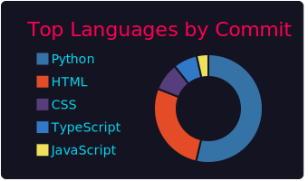
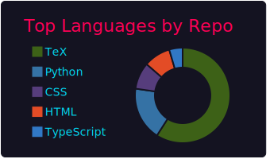

# HELLO WORLD

* [日本語版はこちら](./README.ja.md)

## 👋 Hi there

I'm Kitamado. I majored in mathematics (number theory and discrete optimization) at university.

I have a Master's degree in Mathematics.

I'm working on web development now.

## 🌱 I wish to do

I am taking Computer Science classes at edX while working. I am currently working on CS50 Web Programming.

I would like to learn cryptography and mathematical optimization in the future.

## 🎓 Education

* **Bachelor** Kyoto University, Faculty of Science

* **Master** Kyoto University, Research Institute for Mathematical Science, on Discrete Optimization

* **Verified Certificate** Harvard, CS50 Web Programming with Python and JavaScript (in progress !)

## 🔭 GitHub Stats

[](https://github.com/anuraghazra/github-readme-stats)

## :bar_chart: My Coding Activity

### [WakaTime](https://wakatime.com/)

<!--START_SECTION:waka-->

```text
From: 05 October 2022 - To: 12 October 2022

Total Time: 12 hrs 11 mins

JavaScript   4 hrs 43 mins   █████████▓░░░░░░░░░░░░░░░   38.77 %
HTML         2 hrs 11 mins   ████▒░░░░░░░░░░░░░░░░░░░░   17.98 %
Markdown     1 hr 30 mins    ███░░░░░░░░░░░░░░░░░░░░░░   12.32 %
Python       1 hr 20 mins    ██▓░░░░░░░░░░░░░░░░░░░░░░   11.06 %
JSON         1 hr 2 mins     ██░░░░░░░░░░░░░░░░░░░░░░░   08.50 %
Docker       25 mins         █░░░░░░░░░░░░░░░░░░░░░░░░   03.48 %
```

<!--END_SECTION:waka-->

### Profile Summary Cards

[](https://github.com/vn7n24fzkq/github-profile-summary-cards) [](https://github.com/vn7n24fzkq/github-profile-summary-cards)

## :punch: Karate Punches of Gratitude


## 🧰 Tools experienced

[](https://skillicons.dev)

[](https://skillicons.dev)

## :sparkles: What I like

See my [awesomeList](./awesomeList.md). (Japanese only)

## 📫 Contact, SNS, Blogs

* [Twitter](https://twitter.com/seasawher)...I have a Twitter account, but please do not contact me here.

* [Blog](https://seasawher.hatenablog.com/)...My blog on math.

* [GitBook](https://kitamado.gitbook.io/diary/)...My public memo.

## :bow: Acknowledgments

* The image used as my github icon: みーなのキャラメーカー(β版) (This service no longer exists)
